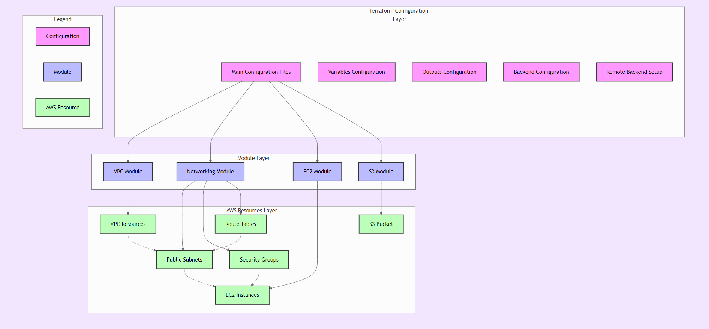

# Terraform AWS Development Environment

This repository contains Terraform configuration files to deploy and manage a development environment on AWS. It provisions key infrastructure components such as VPC, EC2 instances, S3 buckets, and integrates GitHub for deployment pipelines.



## Table of Contents
- [Prerequisites](#prerequisites)
- [Features](#features)
- [Usage](#usage)
- [Variables](#variables)
- [Outputs](#outputs)
- [Best Practices](#best-practices)
- [License](#license)

---

## Prerequisites

Before using this repository, ensure you have the following:
- **Terraform** (v1.4.0 or later) installed on your local machine. [Installation Guide](https://developer.hashicorp.com/terraform/tutorials/aws-get-started/install-cli)
- **AWS CLI** configured with proper credentials. [Configuration Guide](https://docs.aws.amazon.com/cli/latest/userguide/cli-configure-quickstart.html)
- A valid **GitHub Personal Access Token** (if cloning a private repository).

---

## Features

- Provisions an AWS VPC with a configurable CIDR block.
- Creates an EC2 instance with a specified AMI and instance type.
- Deploys an S3 bucket with optional versioning.
- Configures integration with GitHub to pull application code.
- Allows customization through environment-specific variables.

---

## Usage

1. **Clone the Repository**
   ```bash
   git clone https://github.com/your-repo-name.git
   cd your-repo-name
   ```

2. **Set Up Environment Variables**
   Create a `.tfvars` file for your environment (e.g., `dev.tfvars`) and define the required variables. See [Variables](#variables) for details.

3. **Initialize Terraform**
   ```bash
   terraform init
   ```

4. **Validate the Configuration**
   ```bash
   terraform validate
   ```

5. **Apply the Configuration**
   Apply the configuration using your environment's `.tfvars` file:
   ```bash
   terraform apply -var-file=dev.tfvars
   ```

6. **Destroy Resources (if needed)**
   To clean up resources, run:
   ```bash
   terraform destroy -var-file=dev.tfvars
   ```

---

## Variables

Below are the key variables used in the configuration. For detailed descriptions, refer to `variables.tf`.

| Variable             | Description                                      | Example Value              |
|----------------------|--------------------------------------------------|----------------------------|
| `aws_region`         | AWS region where resources are deployed.         | `"us-east-1"`             |
| `environment`        | Logical environment name (e.g., dev, prod).      | `"development"`           |
| `vpc_cidr`           | CIDR block for the VPC.                          | `"10.0.0.0/16"`           |
| `public_subnet_cidr` | CIDR block for the public subnet.                | `"10.0.1.0/24"`           |
| `instance_type`      | EC2 instance type to provision.                  | `"t2.large"`              |
| `ami_id`             | AMI ID for the EC2 instance.                     | `"ami-04b4f1a9cf54c11d0"` |
| `bucket_name`        | Name of the S3 bucket.                           | `"my-application-bucket"` |
| `bucket_versioning`  | Whether versioning is enabled for the S3 bucket. | `true`                    |
| `domain_name`        | Domain name for SSL and Nginx configuration.     | `"example.com"`           |
| `github_token`       | GitHub Personal Access Token for cloning repos.  | `"your-token"`            |
| `git_repo_url`       | URL of the Git repository (without `https`).     | `"org/repo.git"`          |
| `git_branch`         | Git branch to pull code from.                    | `"main"`                  |

---

## Outputs

After deployment, the following outputs will be provided:
- **VPC ID**: Identifier of the created VPC.
- **EC2 Instance Public IP**: Public IP address of the instance.
- **S3 Bucket Name**: Name of the provisioned S3 bucket.

---

## Best Practices

- **Secure Tokens**: Do not hardcode sensitive tokens (e.g., `github_token`) in `.tfvars` files. Use environment variables or a secure secrets manager.
- **State File Security**: Store Terraform state files securely, especially when using remote backends (e.g., S3 with encryption).
- **Cost Management**: Monitor AWS costs regularly to avoid unexpected expenses.
- **Environment Isolation**: Use separate `.tfvars` files for each environment (e.g., `dev.tfvars`, `prod.tfvars`).

---

## License

This project is licensed under the [MIT License](LICENSE).

---

## Contributing

Contributions are welcome! Feel free to open issues or submit pull requests to improve this repository.

---
